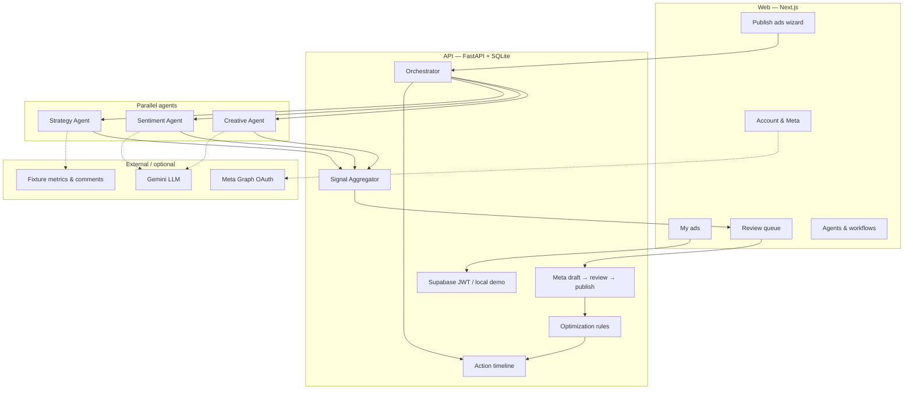
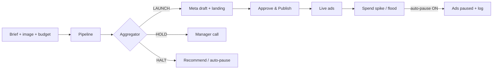

# AdzMate — One-page architecture (judges)

**Team SUDO · IDEALIZE 2026**  
Marketing auto-pilot: product brief → parallel agents → aggregate decision → human approve → publish → optimize / auto-pause.

## System at a glance

## Decision flow

## What is real vs simulated

| Layer | Status |
|-------|--------|
| Orchestrator + 3 parallel agents + aggregator | **Real** |
| Landing page deployer (local HTML preview) | **Real** |
| Action timeline + auto-pause toggle | **Real** |
| Gemini enrichment | **Optional** (templates if off / quota) |
| Meta OAuth account link | **Optional** (demo connect without keys) |
| Ad spend / ROAS / comments / Meta publish IDs | **Simulated** fixtures |

## Seed scenarios (after `python -m app.seed --force`)

| Campaign | Workspace | Expected decision |
|----------|-----------|-------------------|
| Aurora Bottle Launch | Local Demo | LAUNCH |
| Cedar Desk Mixed | Local Demo | HOLD |
| TrailRun Shoes Sprint | Local Demo | LAUNCH |
| Pulse Buds Rescue | Beacon Media | HALT |

## Stack

- **Web:** Next.js 15, Tailwind, Supabase Auth client  
- **API:** FastAPI, SQLAlchemy async, SQLite, SSE events  
- **State:** campaigns, agent_runs, signal_snapshots, recommendations, action_events  

## 3-minute demo path

1. Open **Agents & workflows** — show real vs mock.  
2. **Aurora** → LAUNCH → Approve → Publish.  
3. Switch to **Beacon Media** → **Pulse Buds** → HALT.  
4. On a live campaign → **Spend spike** with auto-pause ON → timeline shows `auto_paused`.
